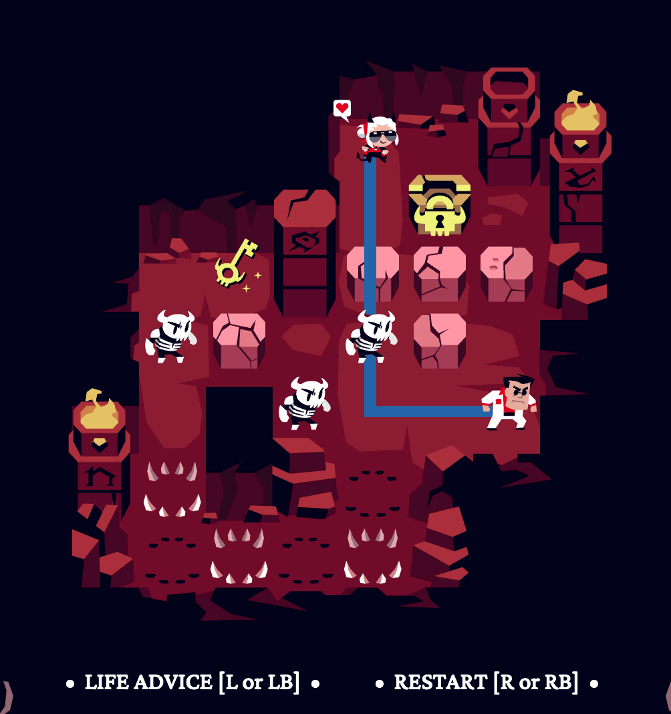
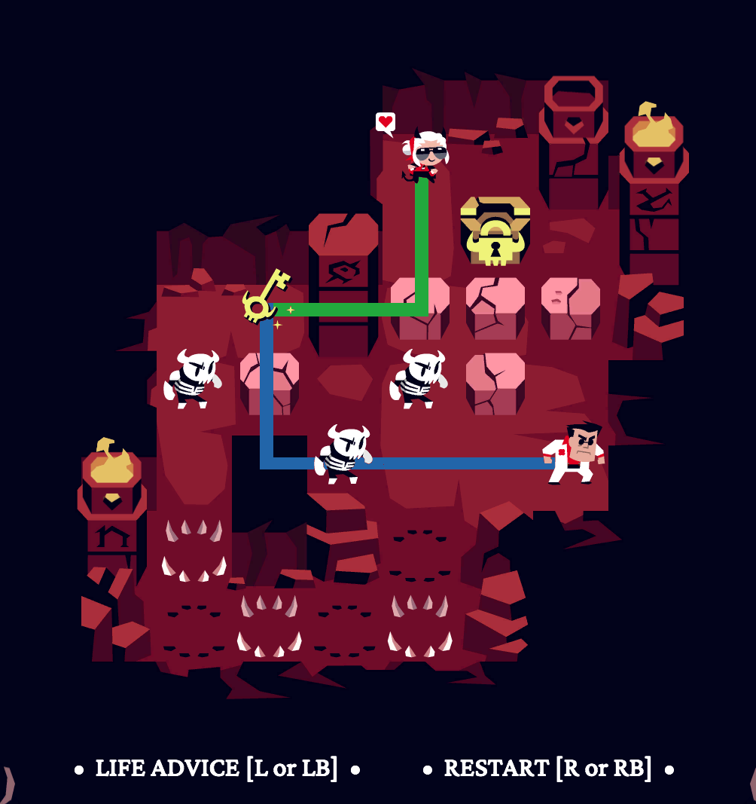

# Helltaker Solver

## Overview

The **helltaker-solver** project contains various utilities for managing *Helltaker* grids, as well as solvers.

## Level Structure

A simple `.txt` file with a title on the first line, the maximum number of moves on the second line, followed by the level description. Lines do not have to be complete.

- `H`: hero
- `D`: demoness
- `#`: wall
- ` ` : empty
- `B`: block
- `K`: key
- `L`: lock
- `M`: mob (skeleton)
- `S`: spikes
- `T`: trap (safe)
- `U`: trap (unsafe)
- `O`: block on spike
- `P`: block on trap (safe)
- `Q`: block on trap (unsafe)

### Example

```
Level 1
23
     ###
  ### H#
 #  M  #
 # M M#
#  ####
# B  B #
# B B  D#
#########
```

## Utilities

The `helltaker_utils` Python3 package allows you to read files and validate plans.

### `grid_from_file(filename: str, voc: dict = {})`

This function reads a file and converts it into a Helltaker grid.

**Arguments:**

- `filename`: the file containing the grid description.
- `voc`: an optional argument that allows you to convert each grid cell into your own vocabulary.

**Returns:**

- A dictionary containing:
  - The game grid as a list of lists of (string) characters.
  - The number of rows `m`.
  - The number of columns `n`.
  - The grid title.
  - The maximum number of moves `max_steps`.

### `check_plan(plan: str)`

This function verifies that your plan is valid.

**Arguments:** a plan as a string.  
**Returns:** `True` if the plan is valid, `False` otherwise.

## Solvers

The two solvers are completely independent (at the cost of some code duplication).

### Answer Set Programming

This solver uses the Answer Set Programming paradigm. You can either solve all levels with the command:
```
cd asp-plan
python asp-generator.py
```
or solve a single level with:
```
cd asp-plan
python helltaker_plan.py <path>
```

### State Space Exploration

This solver uses state space exploration with 4 possible methods:

- Depth-first search.
- Breadth-first search.
- A* with the Manhattan distance heuristic to the goal:  
  
- A* with the Manhattan distance heuristic to the key + distance between the key and the goal:  
  

You can either solve all levels with the command:
```
cd state_space
python helltaker_explo.py
```
or solve a single level with:
```
cd state_space
python helltaker_plan.py <path>
```
